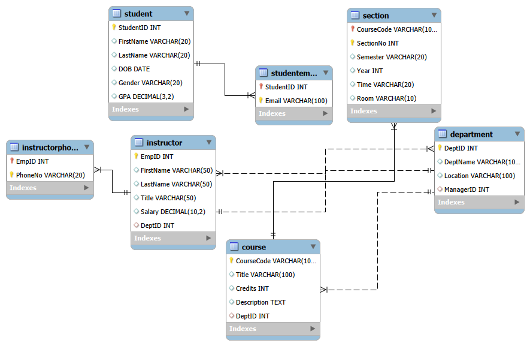
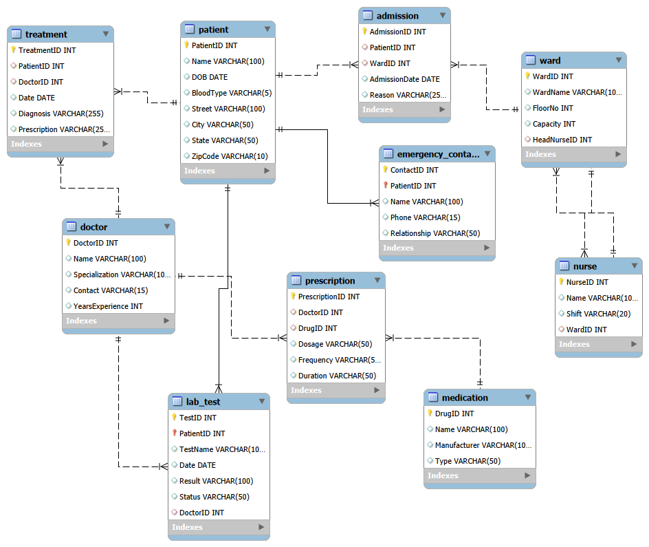
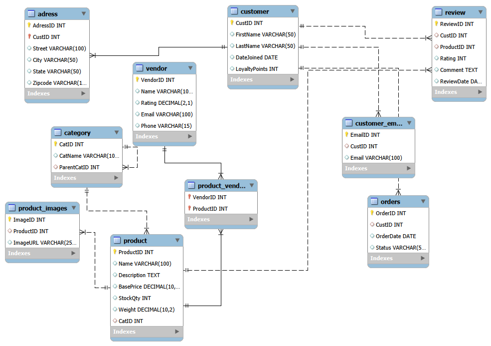

# SQL Practice Set 1 – Online Bookstore Management System (DDL)
> Overview

This SQL practice set contains solutions to 100 advanced MySQL DDL (Data Definition Language) questions based on the Online Bookstore Management System scenario 

SQL Practice Sets
--

The objective of this exercise was to design, modify, and manage a relational database schema that supports a real-world online bookstore platform. The schema includes entities such as:
Authors
Books
Categories
Customers
Orders
OrderDetails
Payments
Delivery Agents
Reviews
Coupons
Return Requests
Wishlists

> What This Practice Covers

This solution demonstrates hands-on implementation of:
- CREATE TABLE with primary keys
- Foreign key relationships & referential integrity
- UNIQUE, NOT NULL, DEFAULT, and CHECK constraints
- Composite primary keys
- ALTER TABLE operations (add/modify/drop columns)
- Renaming tables and columns
- Dropping constraints and tables
- Creating and managing VIEWs
- Real-world schema evolution scenarios

> Learning Objectives

Through solving these 100 questions, I practiced:
Designing normalized relational database structures
Applying business rules using constraints
Maintaining data integrity with foreign keys
Performing schema evolution using DDL commands
Simulating real-world backend database changes

> Tech Stack

MySQL
DDL Commands
Relational Database Design Principles

> Structure

The practice set is divided into sections:
Section A: Table Creation & Basic Constraints
Section B: Altering Tables & Adding Constraints
Section C: Delivery Agents Schema
Section D: Dropping & Renaming
Section E: Views & Advanced Constraints
Section F: Real-World Scenarios
Section G: Final Challenges

----------------------------------------------------------------------------------------------------------

# SQL Practise set 2 – Database Management Systems

This repository contains solutions for 10 SQL practical sets covering different real-world database scenarios.

> Sets Included

1. Online Bookstore  
2. Hospital Management System  
3. University Management System  
4. Airline Reservation System  
5. Hotel Management System  
6. Library Management System  
7. Inventory Management System  
8. Online Food Delivery System  
9. Cinema Ticket Booking System  
10. E-Learning Platform  

---

> Technologies Used

- MySQL
- SQL (DDL, DML, Queries)
- Relational Database Concepts

---

> File Included

- `PRACTISE SET 2 SOLn.sql` → Contains:
  - Database creation
  - Table structures
  - Data insertion
  - 25 queries for each set

---

> How to Run

1. Open MySQL Workbench / phpMyAdmin / XAMPP
2. Open the `.sql` file
3. Execute the script
4. Run queries to see results

---

> Key Concepts Covered

- Database Design
- Primary & Foreign Keys
- Joins (INNER, LEFT)
- Aggregate Functions (COUNT, SUM, AVG)
- Subqueries
- Filtering & Sorting

---

> Author

- Name: (Maqveena Gourea)

---

> Notes

This project is created for academic practice and understanding SQL concepts with real-world scenarios.

----------------------------------------------------------------------------------------------------------

# ER Diagrams

This project includes Entity-Relationship (ER) diagrams for selected database systems to visually represent the structure, relationships, and constraints between entities.

---

### University Management System

**Description:**
Represents entities like Students, Courses, Instructors, Departments, and their relationships such as enrollments and sections.

---

### Hospital Management System

**Description:**
Illustrates relationships between Patients, Doctors, Wards, Treatments, Admissions, and Medical Records.

---

### E-Commerce System

**Description:**
Shows entities such as Customers, Products, Orders, Vendors, Categories, and their interactions including purchases and reviews.

---

## Notes

- ER diagrams were created using **MySQL Workbench**
- Diagrams are exported as images for better visualization
- They help in understanding database design before implementation

---
